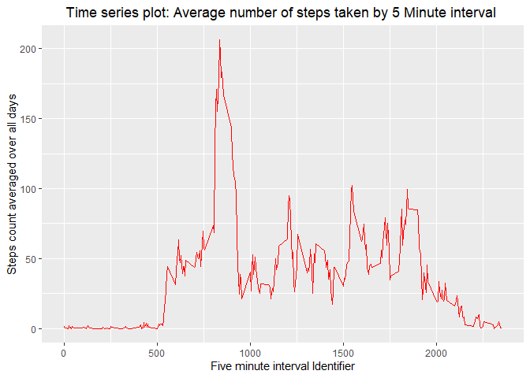
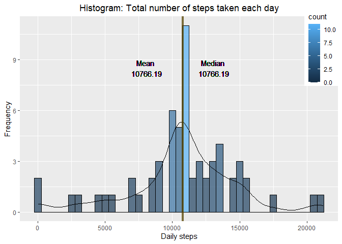
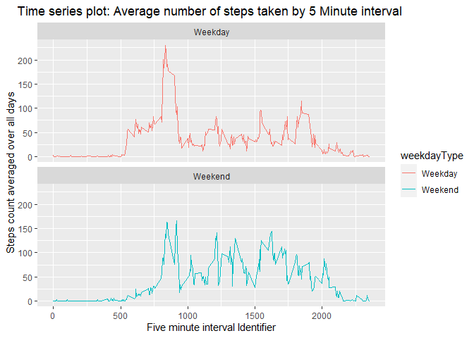

## Loading and preprocessing the data
- Package(s) loading

```r
library(dplyr)
library(ggplot2)
```

- Data loading

```r
act_data<- read.csv("activity.csv")
```

- Data Processing

```r
# Coverting date column from factor to DATE
act_data$date<-as.Date(act_data$date)

# Showing first few rows of the imputed dataset
head(act_data)
```

```
##   steps       date interval
## 1    NA 2012-10-01        0
## 2    NA 2012-10-01        5
## 3    NA 2012-10-01       10
## 4    NA 2012-10-01       15
## 5    NA 2012-10-01       20
## 6    NA 2012-10-01       25
```

## What is mean total number of steps taken per day?

- Total number of steps taken per day

```r
# Grouping steps count by Date, then adding them accross groups.
totalStepsPerDay<- act_data %>% group_by(date) %>%
    summarise(steps=sum(steps,na.rm=TRUE))
totalStepsPerDay
```

```
## # A tibble: 61 x 2
##    date       steps
##    <date>     <int>
##  1 2012-10-01     0
##  2 2012-10-02   126
##  3 2012-10-03 11352
##  4 2012-10-04 12116
##  5 2012-10-05 13294
##  6 2012-10-06 15420
##  7 2012-10-07 11015
##  8 2012-10-08     0
##  9 2012-10-09 12811
## 10 2012-10-10  9900
## # ... with 51 more rows
```

- Histogram of the total number of steps taken each day


```r
# Calculating mean and median for the plot
mean1<-round(mean(totalStepsPerDay$steps),2)
median1<-round(median(totalStepsPerDay$steps),2)
# Histogram  generation
ggplot(totalStepsPerDay, aes(steps))+
    geom_histogram(binwidth = 500,alpha=0.7, col="black",aes( fill=..count..,))+
    geom_density(aes(y=..count.. *500))+
    geom_vline(xintercept = mean1,color="red",size=1.5,alpha=0.5)+
    geom_text(aes(x=8000, label=paste("Mean\n",mean1), y=8.5))+
    geom_vline(xintercept = median1,color="darkgreen",size=1.5,alpha=0.5)+
    geom_text(aes(x=12000, label=paste("Median\n",median1), y=8.5))+
    labs(title = "Histogram: Total number of steps taken each day", x="Daily steps", y="Frequency")+
    theme(legend.position = c(0.95,0.85), plot.title = element_text(hjust = 0.5))
```

<!-- -->

- Mean and median of the total number of steps taken per day

```r
# Mean calculation
mean1<-round(mean(totalStepsPerDay$steps),2)
print(paste("Mean = ",mean1))
```

```
## [1] "Mean =  9354.23"
```

```r
# Median calculation
median1<-round(median(totalStepsPerDay$steps),2)
print(paste("Median = ",median1))
```

```
## [1] "Median =  10395"
```

## What is the average daily activity pattern?
- Time series plot of the 5-minute interval (x-axis) and the average number of steps taken, averaged across all days (y-axis)

```r
# Grouping steps count by interval, then calculating means across groups
timeSeriesData<- act_data %>% group_by(interval) %>% summarise(steps=mean(steps,na.rm=TRUE))
# Time series plot
ggplot(timeSeriesData, aes(x=interval, y=steps))+
    geom_line(color="red")+
    labs(title = "Time series plot: Average number of steps taken by 5 Minute interval ",
         x="Five minute interval Identifier", y="Steps count averaged over all days")+
    theme( plot.title = element_text(hjust = 0.5))
```

<!-- -->

- 5-minute interval with the maximum number of steps (average across all the days in the dataset)

```r
maxinterval<- timeSeriesData[which.max(timeSeriesData$steps),]
names(maxinterval)<- c("Interval identifier", "Maximun average steps")
maxinterval
```

```
## # A tibble: 1 x 2
##   `Interval identifier` `Maximun average steps`
##                   <int>                   <dbl>
## 1                   835                    206.
```

## Imputing missing values
-  Total number of missing values in the original dataset 

```r
colSums(is.na(act_data))
```

```
##    steps     date interval 
##     2304        0        0
```

- Replacing missing values with mean of steps across all days for that specific 5 minute interval

```r
# Grouping steps count by interval, then replacing missing steps count value with mean of steps across all days for that specific 5 minute interval
imputed_data<- act_data %>% group_by(interval) %>% 
    mutate(steps= replace(steps, is.na(steps), mean(steps,na.rm=TRUE) ))
# Checking missing value number in the new formatted dataset
colSums(is.na(imputed_data))
```

```
##    steps     date interval 
##        0        0        0
```

- New imputed dataset

```r
# Showing first few rows of the imputed dataset
head(imputed_data)
```

```
## # A tibble: 6 x 3
## # Groups:   interval [6]
##    steps date       interval
##    <dbl> <date>        <int>
## 1 1.72   2012-10-01        0
## 2 0.340  2012-10-01        5
## 3 0.132  2012-10-01       10
## 4 0.151  2012-10-01       15
## 5 0.0755 2012-10-01       20
## 6 2.09   2012-10-01       25
```

- Imputed data - Histogram, mean and median

```r
# Grouping steps count by Date, Then adding steps count across groups
totalStepsPerDay_imputed<- imputed_data %>%
    group_by(date) %>%
    summarise(steps=sum(steps,na.rm=TRUE))
# calculating mean and median for the histogram
mean2<-round(mean(totalStepsPerDay_imputed$steps),2)
median2<-round(median(totalStepsPerDay_imputed$steps),2)
# Histogram  generation
ggplot(totalStepsPerDay_imputed, aes(steps))+
    geom_histogram(binwidth = 500,alpha=0.7, col="black",aes( fill=..count..,))+
    geom_density(aes(y=..count.. *500))+
    geom_vline(xintercept = mean2,color="red",size=1.5,alpha=0.5)+
    geom_text(aes(x=8000, label=paste("Mean\n",mean2), y=8.5))+
    geom_vline(xintercept = median2,color="darkgreen",size=1.5,alpha=0.5)+
    geom_text(aes(x=13000, label=paste("Median\n",median2), y=8.5))+
    labs(title = "Histogram: Total number of steps taken each day", x="Daily steps", y="Frequency")+
    theme(legend.position = c(0.95,0.85), plot.title = element_text(hjust = 0.5))
```

<!-- -->

THe mean and median value is same. That is why, in the histogram, the red mean line and green median line merged and created a brown line.  


```r
# Mean 
print(paste("Mean = ",mean2))
```

```
## [1] "Mean =  10766.19"
```

```r
# Median
print(paste("Median = ",median2))
```

```
## [1] "Median =  10766.19"
```

According to the histogram and the calculated mean and median values, Imputing missing values in the dataset made the steps count variable more normalized. Also, the mean and median value became same.

## Are there differences in activity patterns between weekdays and weekends?
- New factor variable in the dataset with two levels – “weekday” and “weekend” 

```r
# Adding new column to specify the weekdays based on the dates
imputed_data$weekday <- weekdays(imputed_data$date)

# Adding new column named weekdayType to specify whether the date is a weekday or a weekend
imputed_data$weekdayType<-ifelse(weekdays(imputed_data$date) %in% c("Saturday","Sunday"), "Weekend", "Weekday")

# Showing first few rows of the modified data 
head(imputed_data)
```

```
## # A tibble: 6 x 5
## # Groups:   interval [6]
##    steps date       interval weekday weekdayType
##    <dbl> <date>        <int> <chr>   <chr>      
## 1 1.72   2012-10-01        0 Monday  Weekday    
## 2 0.340  2012-10-01        5 Monday  Weekday    
## 3 0.132  2012-10-01       10 Monday  Weekday    
## 4 0.151  2012-10-01       15 Monday  Weekday    
## 5 0.0755 2012-10-01       20 Monday  Weekday    
## 6 2.09   2012-10-01       25 Monday  Weekday
```

- Panel plot containing a time series plot of the 5-minute interval (x-axis) and the average number of steps taken, averaged across all weekday days or weekend days (y-axis)


```r
# Grouping steps count by weekdayType and interval accordingly, Then mean of steps count across groups
timeSeriesData2<- imputed_data %>% group_by(weekdayType,interval) %>% summarise(steps = mean(steps, na.rm=TRUE))

# Panel plot
ggplot(timeSeriesData2, aes(x=interval, y=steps, color=weekdayType))+
    facet_wrap(weekdayType~.,ncol = 1)+
    geom_line()+
    labs(title = "Time series plot: Average number of steps taken by 5 Minute interval ",
         x="Five minute interval Identifier", y="Steps count averaged over all days")+
    theme( plot.title = element_text(hjust = 0.5))
```

<!-- -->

